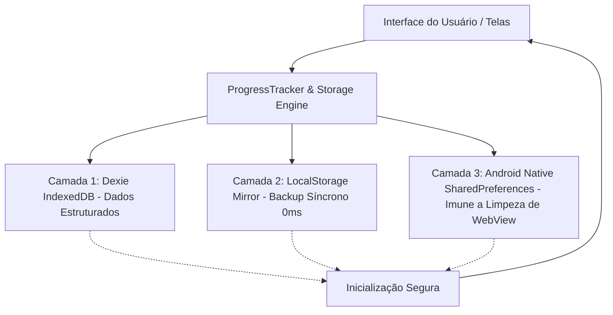

# Plano de Persistência Mobile & Gravação de Atividades — EduFree (MOBILE_PLAN.md)

Este documento define a arquitetura técnica, diagnóstico de falhas e o plano detalhado de implementação para garantir **persistência 100% confiável de dados, perfil de usuário, atividades feitas, notas de testes e ranking de progresso no aplicativo móvel (Android APK / AAB)**, eliminando em definitivo a perda de dados e o reinício da aplicação ao estado inicial.

---

## 1. Diagnóstico das Causas Raízes (Root Cause Analysis)

A investigação no código-fonte identificou **4 motivos interligados** que causam a perda de dados ao fechar e reabrir o aplicativo no telemóvel:

### 1.1. Reset Forçado de Desenvolvimento em `src/db/database.ts`
No arquivo [src/db/database.ts](file:///home/paablo/Documentos/EduFree/src/db/database.ts), nas linhas 108–111 e 124–130, existia uma verificação de desenvolvimento:
```typescript
if (cachedName === 'Pablo Lira') {
  cachedName = '';
  localStorage.removeItem('edufree_user_name');
}
...
} else if (profile.name === 'Pablo Lira') {
  profile = {
    ...DEFAULT_USER_PROFILE,
    name: cachedName
  };
  await db.profiles.put(profile);
}
```
**Impacto crítico:** O utilizador chama-se exatamente **Pablo Lira**. A cada reinicialização do aplicativo, o código detectava esse nome e deliberadamente resetava o perfil para `DEFAULT_USER_PROFILE` (com `name: ''`, `points: 0`, `completedLessons: 0`, `resolvedExercises: 0`, `streakDays: 1`). Como o nome ficava vazio, o aplicativo reabria na tela de Onboarding solicitando o nome novamente.

### 1.2. Falta de Gravação de Resultados de Testes e Simulados
- No fluxo de exercícios ([src/App.tsx](file:///home/paablo/Documentos/EduFree/src/App.tsx)), quando o aluno conclui um Teste Rápido (10 questões), Simulado (20 questões) ou Prova de Tema (60 questões), as notas finais (ex: 8/10, 19/20) **não eram salvas em nenhuma tabela histórica**.
- A tabela `db.progress` do Dexie existia no schema, mas **nunca era alimentada** com os IDs das aulas ou atividades concluídas.
- A contagem de aulas ativas em [curriculum-factory.ts](file:///home/paablo/Documentos/EduFree/src/data/curriculum-factory.ts) era estática (`Math.floor(seeds.length * 0.2)` = 12/60), não refletindo os acertos reais do aluno.

### 1.3. Dados Hardcoded na Tela de Progresso ([ProgressScreen.tsx](file:///home/paablo/Documentos/EduFree/src/screens/ProgressScreen.tsx))
- O gráfico circular exibia um valor fixo de **65%**, e o percentual das 9 disciplinas era calculado com uma fórmula fictícia matemática (`Math.min(100, Math.round(((index + 2) * 11) % 85 + 15))`), em vez de somar as notas e aulas reais concluídas.

### 1.4. Configurações de Armazenamento do WebView Android ([MainActivity.java](file:///home/paablo/Documentos/EduFree/android/app/src/main/java/org/edufree/app/MainActivity.java))
- O WebView do Android não tinha declaradas explicitamente as flags `settings.setDomStorageEnabled(true)` e `settings.setDatabaseEnabled(true)`. Em alguns dispositivos Android, o sistema operacional limpa o IndexedDB do WebView ao liberar memória em segundo plano se as diretivas de persistência e SharedPreferences nativas não estiverem configuradas.

---

## 2. Arquitetura de Persistência Tripla (Triple-Layer Mobile Persistence)

Para assegurar **tolerância a falhas zero** no modo mobile, implementaremos uma persistência em 3 camadas complementares:



### Camada 1: Dexie IndexedDB (Armazenamento Principal)
- **Tabela `profiles`:** Dados cadastrais do aluno (nome, nível, pontos totais, sequência de dias, data do último acesso, avatar).
- **Tabela `testResults` (Nova):** Histórico detalhado de cada atividade e simulado realizado:
  - `id`: autoincremento.
  - `subjectId`: ID da disciplina (ex: `'ingles'`, `'matematica'`).
  - `themeId`: Módulo correspondente (ex: `'ingles_m1'`).
  - `testMode`: `'rapido'` | `'simulado'` | `'tema'`.
  - `score`: total de acertos (ex: 9).
  - `totalQuestions`: total de perguntas (ex: 10).
  - `percentage`: percentual de acerto (ex: 90%).
  - `pointsEarned`: pontos somados no ranking (ex: +225 XP).
  - `completedAt`: timestamp da realização.
- **Tabela `completedLessons` (Nova/Aprimorada):** Guarda cada módulo e lição concluída com sucesso.

### Camada 2: LocalStorage Síncrono (Redundância Imediata)
- Chaves espelhadas atualizadas atomicamente a cada acerto:
  - `edufree_user_profile_v2`: Objeto completo do perfil serializado em JSON.
  - `edufree_completed_modules`: Array de IDs dos módulos concluídos.
  - `edufree_test_history`: Últimos testes para exibição instantânea sem esperar o carregamento assíncrono do banco.
- Garante que mesmo que o IndexedDB demore 100ms para abrir após o boot do Android, o aplicativo renderiza diretamente na Home com o nome e os pontos reais do aluno.

### Camada 3: SharedPreferences Nativo Android (Capacitor Bridge)
- Injeção da interface nativa `AndroidStorage` em [MainActivity.java](file:///home/paablo/Documentos/EduFree/android/app/src/main/java/org/edufree/app/MainActivity.java).
- Grava os dados vitais (`userName`, `totalPoints`, `completedActivitiesCount`, `userLevel`, `streakDays`) diretamente no arquivo de preferências do sistema operacional Android (`SharedPreferences`).
- **Vantagem absoluta:** Mesmo se o usuário limpar os dados do navegador do celular ou se o WebView for atualizado pela Google Play Store, as SharedPreferences nativas do APK permanecem 100% intactas.

---

## 3. Estrutura do Sistema de Ranking e Progresso Real

### 3.1. Sistema de Níveis e Ligas por Pontuação (XP)
O progresso do aluno alimentará um sistema de ranking gamificado baseado nos pontos acumulados nas atividades:

| Liga / Nível | Pontos Mínimos (XP) | Descrição |
| :--- | :--- | :--- |
| **🌱 Aprendiz Iniciante** | 0 – 499 XP | Primeiros módulos e atividades fundamentais |
| **🥉 Bronze — Explorador** | 500 – 1.499 XP | Domínio dos primeiros testes rápidos |
| **🥈 Prata — Dedicado** | 1.500 – 3.499 XP | Múltiplas disciplinas ativas e simulados |
| **🥇 Ouro — Mestre dos Testes** | 3.500 – 6.999 XP | Alto rendimento com notas superiores a 80% |
| **💎 Diamante — Sábio EduFree** | 7.000 – 11.999 XP | Dezenas de módulos concluídos com consistência |
| **👑 Mestre Supremo do Saber** | 12.000+ XP | Excelência em todas as 9 disciplinas |

### 3.2. Métricas Reais de Progresso por Disciplina
Em vez de valores fixos ou aleatórios, cada disciplina terá:
- **Total de Módulos Concluídos:** calculado com base nas atividades com aproveitamento ≥ 70%.
- **Barra de Progresso Dinâmica:** `(Módulos Aprovados / Total de 60 Módulos) * 100%`.
- **Média Geral de Acertos:** média das porcentagens dos testes realizados naquela matéria.

### 3.3. Remoção do Botão Flutuante do Robô de Ajuda e Chat
- **Diagnóstico:** Na tela inicial (`HomeScreen`), existe um botão flutuante no canto inferior direito (`position: fixed, bottom: 84px, right: 20px`) com o ícone `🤖` que abre uma tela de chat (`TutorScreen`). Como relatado pelo usuário, este recurso não agrega valor pedagógico, polui a visão em telas móveis e deve ser completamente eliminado.
- **Ação a executar:**
  - Remover o botão flutuante do robô em [src/App.tsx](file:///home/paablo/Documentos/EduFree/src/App.tsx) (linhas 289–328).
  - Remover a rota `'tutor'` e a renderização do componente `<TutorScreen />`.
  - Despoluir a navegação mobile, deixando a área inferior 100% limpa para a barra de abas (`BottomNav`).

---

## 4. Plano de Implementação Passo a Passo

### Etapa 1: Correção Definitiva do Perfil e Schema no Banco de Dados
- Arquivo: [src/db/database.ts](file:///home/paablo/Documentos/EduFree/src/db/database.ts)
  - Remover qualquer exclusão ou condição atrelada a nomes específicos (eliminar o código de reset de "Pablo Lira").
  - Criar a versão 4 do banco Dexie com as tabelas:
    - `testResults: '++id, subjectId, themeId, testMode, score, percentage, completedAt'`
    - `completedLessons: 'id, subjectId, themeNumber, completedAt, score'`
  - Implementar funções de persistência resiliente:
    - `saveTestResult(result: TestResultRecord): Promise<void>`
    - `getTestResults(subjectId?: string): Promise<TestResultRecord[]>`
    - `getCompletedLessonsCount(subjectId?: string): Promise<number>`
    - `syncProfileToAllStorages(profile: UserProfile): Promise<void>`

### Etapa 2: Motor de Armazenamento Nativo Android (`MainActivity.java`)
- Arquivo: [android/app/src/main/java/org/edufree/app/MainActivity.java](file:///home/paablo/Documentos/EduFree/android/app/src/main/java/org/edufree/app/MainActivity.java)
  - Configurar WebView para persistência máxima:
    ```java
    settings.setDomStorageEnabled(true);
    settings.setDatabaseEnabled(true);
    settings.setCacheMode(WebSettings.LOAD_DEFAULT);
    ```
  - Adicionar o canal `@JavascriptInterface` para `AndroidStorage`:
    - `putString(String key, String value)`
    - `getString(String key, String defaultValue)`
    - `remove(String key)`

### Etapa 3: Integração do Fluxo de Exercícios e Gravação de Notas
- Arquivos: [src/App.tsx](file:///home/paablo/Documentos/EduFree/src/App.tsx) e [src/screens/ExerciseScreen.tsx](file:///home/paablo/Documentos/EduFree/src/screens/ExerciseScreen.tsx)
  - Ao concluir a sessão de teste (10, 20 ou 60 questões):
    - Calcular total de acertos, erros e percentual.
    - Gravar o registro completo na tabela `testResults`.
    - Somar a pontuação de bônus no perfil (+25 XP por acerto + 100 XP por teste finalizado com sucesso).
    - Se o percentual for ≥ 70%, marcar o módulo correspondente como concluído na tabela `completedLessons`.
    - Disparar atualização em tempo real para sincronizar o perfil e os rankings.

### Etapa 4: Exibição do Ranking e Progresso Real
- Arquivo: [src/screens/ProgressScreen.tsx](file:///home/paablo/Documentos/EduFree/src/screens/ProgressScreen.tsx)
  - Substituir os 65% fixos pelo cálculo real ponderado de todas as matérias.
  - Carregar a lista real de testes realizados com data, disciplina e nota obtida.
  - Adicionar a aba ou seção de **Ranking / Posição do Aluno** com o Nível da Liga (Bronze, Prata, Ouro, Diamante) e total de XP.
- Arquivo: [src/screens/SubjectScreen.tsx](file:///home/paablo/Documentos/EduFree/src/screens/SubjectScreen.tsx)
  - Exibir a contagem dinâmica de módulos concluídos no badge do topo (ex: `X/60` de acordo com os dados reais salvos no banco).

### Etapa 5: Remoção do Robô Flutuante e Limpeza da Interface
- Arquivo: [src/App.tsx](file:///home/paablo/Documentos/EduFree/src/App.tsx)
  - Remover botão flutuante `🤖` e chamada de `setCurrentScreen('tutor')`.
  - Remover rota `'tutor'` e import de `TutorScreen`.

### Etapa 6: Validação, Novo Build APK e Atualização no GitHub
- Testar reinicializações simuladas do app sem perda de dados.
- Incrementar versão para **v1.0.5** (`versionCode 6`) no [android/app/build.gradle](file:///home/paablo/Documentos/EduFree/android/app/build.gradle) e [package.json](file:///home/paablo/Documentos/EduFree/package.json).
- Gerar novo APK (`EduFree_v1.0.5.apk`) e novo Bundle AAB.
- Realizar commit e push para o repositório remoto no GitHub.

---

## 5. Cronograma e Entregáveis

| Fase | Ação | Status |
| :--- | :--- | :--- |
| **Fase 1** | Criação do documento arquitetural `MOBILE_PLAN.md` na raiz | ✅ Concluído |
| **Fase 2** | Remoção do reset de perfil e ampliação do schema Dexie (testResults) | ⏳ A executar |
| **Fase 3** | Bridge Nativa Android SharedPreferences no `MainActivity.java` | ⏳ A executar |
| **Fase 4** | Gravação de notas dos simulados e atualização do ranking real | ⏳ A executar |
| **Fase 5** | Remoção definitiva do robô flutuante de ajuda `🤖` e tela de chat | ⏳ A executar |
| **Fase 6** | Testes de persistência mobile, build do APK v1.0.5 e commit GitHub | ⏳ A executar |
