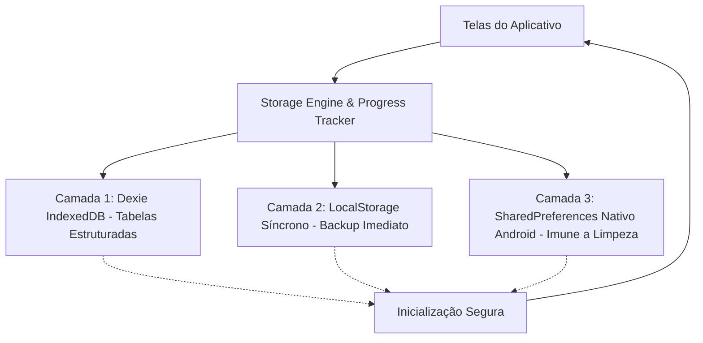

# Plano de Persistência Mobile, Áudio Natural & Gravação de Atividades — EduFree (MOBILE_PLAN.md)

Este documento define a arquitetura técnica, diagnóstico de falhas e o plano detalhado de implementação para garantir:
1. **Qualidade Vocal Impecável e Natural:** Eliminação definitiva de qualquer voz robotizada; padronização na voz feminina brasileira **Francisca (`pt-BR-FranciscaNeural`)** em todo o aplicativo, com alternância pontual para a voz feminina americana **Jenny (`en-US-JennyNeural`)** exclusivamente em termos/frases em inglês na disciplina de Inglês;
2. **Entonação Correta sem Leitura de Pontuações:** O sintetizador nunca deve verbalizar nomes de caracteres como *"ponto"*, *"ponto ponto"*, *"dois pontos"* ou *"exclamação"*; a pontuação deve atuar estritamente como modulador de entonação e pausas oracionais naturais;
3. **Persistência 100% Confiável no Mobile (Android APK / AAB):** Eliminação do reset de dados e Onboarding infinito, gravação real do histórico de testes/simulados, notas e ranking de progresso;
4. **Remoção Definitiva do Robô Flutuante:** Eliminação do botão de chat inferior `🤖` e simplificação da experiência de navegação do aluno.

---

## 1. Padrão de Síntese de Voz (TTS Natural & Bilíngue)

### 1.1. Voz Feminina Padrão do Aplicativo: Francisca (`pt-BR`)
- **Regra Fundamental:** A voz de narração de todo o EduFree (aulas, explicações conceituais, enunciados de testes, dicas, menus e perfil) é **sempre feminina, brasileira e de altíssima fidelidade natural** utilizando o modelo **Francisca (`pt-BR-FranciscaNeural`)**.
- **Resolução do Problema da Voz Robotizada:**
  - O áudio robotizado ocorre quando a aplicação cai no sintetizador sintético genérico do sistema operacional (ex: eSpeak em Linux ou voz básica sem rede).
  - Para garantir a voz de estúdio em qualquer circunstância:
    1. **Edge TTS com Cache IndexedDB:** Ao sintetizar via `/api/tts`, o áudio em MP3 cristalino da Francisca é gravado no IndexedDB (`db.audioCache`). Mesmo quando o aplicativo estiver 100% offline, os áudios já reproduzidos tocam instantaneamente direto do cache local.
    2. **Fallback Web Speech API Inteligente:** Caso não haja rede e o áudio não esteja em cache, o motor seleciona cirurgicamente as vozes femininas de alta qualidade instaladas no navegador (ex: *Google português do Brasil*, *Luciana*, *Francisca Online Natural*), banindo vozes masculinas ou sintetizadores sintéticos robóticos.
    3. **Android Native TTS (`MainActivity.java`):** No APK Android, a interface nativa localiza a voz feminina do pacote de voz do Google para português do Brasil (`pt-BR`), garantindo naturalidade e ausência de robotização no telemóvel.

### 1.2. Alternância para Jenny (`en-US`) Exclusiva na Disciplina de Inglês
- Na disciplina de **Inglês**, a explicação conceitual e pedagógica permanece na voz brasileira da Francisca (`pt-BR`).
- Apenas as palavras, frases e termos em inglês (ex: *"To Be"*, *"I am a student"*, *"Greetings"*, *"Good morning"*, *"She is happy"*) são pronunciados pela voz feminina nativa norte-americana **Jenny (`en-US-JennyNeural`)**.
- A transição é suave e transparente, ocorrendo através de segmentação fonética e sem interrupções audíveis.

### 1.3. Regras Estritas de Pontuação e Entonação Natural
- **Problema Diagnosticado:** Sintetizadores de voz verbalizam *"ponto"*, *"ponto ponto"* ou *"exclamação"* quando recebem reticências (`...`), pontos consecutivos (`..`), pontos no início de frases (`. O verbo`), ou pontos de exclamação isolados (`!`).
- **Solução Implementada (Motor de Sanitização de Fala):**
  - **Zero Leitura de Caracteres Especiais:** Nenhum caractere gráfico deve ser verbalizado.
  - **Reticências e Sequências de Pontos (`...`, `..`):** Convertidas em um único ponto com espaçamento oracional adequado, instruindo o modelo TTS a fazer uma pausa de cadência e entonação de fim de oração sem falar *"ponto"*.
  - **Exclamação (`!`):** Convertida para ponto final (`.`), garantindo ênfase oracional sem o risco de o motor falar *"ponto de exclamação"*.
  - **Aspas e Parênteses (`"`, `'`, `(`, `)`):** Removidos do texto de síntese para que o motor não pronuncie *"aspas"* ou *"abre parênteses"*, mantendo apenas as palavras limpas com pausa virgular suave.
  - **Dois Pontos (`:`) e Ponto e Vírgula (`;`):** Convertidos em vírgula (`,`), produzindo uma pausa de continuidade sem leitura literal de *"dois pontos"*.
  - **Higienização de Início de Segmento:** Remoção obrigatória de qualquer pontuação solta no início de um segmento (`^[.,;:!?\s]+`). Se um fragmento começar com `.`, o ponto é descartado para que o motor nunca inicie dizendo *"ponto"*.

### 1.4. Fidelidade Absoluta ao Texto da Tela (Sem Invenções ou Prompts Artificiais)
- **Problema Diagnosticado:** Ao tocar em "Ouvir Aula", o áudio prefixava o título/pergunta conceitual (ex: *"O que é Verbo To Be no Presente (Am, Is, Are) e como aplicar no dia a dia?"*). O motor lia fragmentos isolados como `(Am, Is, Are)` soltos no meio do áudio, causando estranheza porque o aluno estava lendo o corpo da aula.
- **Regra de Fidelidade Pedagógica:**
  - O áudio da aula deve narrar **estritamente o que está escrito no corpo do texto da aula** (`description`) e no bloco de exemplos (`exampleText`).
  - Não inventar palavras, não ler cabeçalhos intermediários desnecessários e não injetar listas de parênteses fora de contexto. O aluno deve ouvir exatamente as orações que seus olhos estão acompanhando na tela.

### 1.5. Controle de Velocidade Educacional (0.85x a 0.95x)
- **Problema Diagnosticado:** A velocidade nativa padrão do inglês falava rápido demais para quem está aprendendo a matéria.
- **Ajustes de Cadência:**
  - **Segmentos em Inglês (`en-US-JennyNeural` / WebSpeech / Android):** Taxa reduzida para **0.85x a 0.88x** (`rate: '-15%'`), permitindo ao aluno assimilar fonemas e pronúncias com clareza cristalina.
  - **Segmentos em Português (`pt-BR-FranciscaNeural`):** Taxa regulada para **0.92x a 0.95x** (`rate: '-8%'`), garantindo uma aula calma, acolhedora e sem atropelos.

---

## 2. Diagnóstico da Perda de Dados no Mobile (Causa Raiz)

A investigação identificou **4 motivos interligados** que provocavam a perda de progresso ao fechar o app no celular:

1. **Reset Hardcoded em `src/db/database.ts`:**
   Nas linhas 108–111 e 124–130, o código continha:
   ```typescript
   if (cachedName === 'Pablo Lira') {
     cachedName = '';
     localStorage.removeItem('edufree_user_name');
   }
   ```
   A cada inicialização, o aplicativo detectava o nome do usuário e forçava a limpeza do perfil, jogando-o de volta ao Onboarding.
2. **Ausência de Tabela Histórica de Resultados de Testes:**
   Ao concluir testes rápidos (10 questões), simulados (20 questões) ou provas de tema (60 questões), as notas nunca eram salvas no banco de dados.
3. **Métricas Fictícias na Tela de Progresso:**
   A tela [ProgressScreen.tsx](file:///home/paablo/Documentos/EduFree/src/screens/ProgressScreen.tsx) exibia percentuais gerados por uma fórmula matemática estática em vez de calcular o aproveitamento real dos testes feitos.
4. **WebView Android sem Flags de Persistência:**
   O WebView do APK precisava das flags explícitas de persistência (`setDomStorageEnabled`, `setDatabaseEnabled`) e de espelhamento em `SharedPreferences`.

---

## 3. Arquitetura de Persistência Tripla (Mobile Resilient Storage)



### Camada 1: Dexie IndexedDB (Armazenamento Principal)
- **Tabela `profiles`:** Dados cadastrais do aluno (nome, nível, pontos totais, sequência de dias, último acesso).
- **Tabela `testResults` (Nova):** Histórico de testes realizados:
  - `id`, `subjectId`, `themeId`, `testMode`, `score`, `totalQuestions`, `percentage`, `pointsEarned`, `completedAt`.
- **Tabela `completedLessons` (Nova):** Módulos com aprovação (aproveitamento ≥ 70%).
- **Tabela `audioCache`:** Cache de áudios TTS em MP3 (Francisca pt-BR e Jenny en-US) para execução offline instantânea.

### Camada 2: LocalStorage Síncrono (Redundância 0ms)
- Espelho serializado do perfil (`edufree_user_profile_v2`) e do histórico rápido. Garante carregamento instantâneo sem delay de inicialização assíncrona.

### Camada 3: SharedPreferences Nativo Android (`MainActivity.java`)
- Interface nativa `@JavascriptInterface` gravando dados vitais diretamente no arquivo de preferências do sistema operacional Android. Imune a limpezas de cache de navegador ou atualizações de WebView.

---

## 4. Remoção do Robô Flutuante de Ajuda (`🤖` / Tutor)

- **Diagnóstico:** O botão flutuante inferior direito (`Robo_EduFree.png`) abria a tela de chat do tutor. Além de redundante, poluía a área inferior de navegação e colidia com o layout de telas menores.
- **Ação:**
  - Remoção completa do botão flutuante em [src/App.tsx](file:///home/paablo/Documentos/EduFree/src/App.tsx).
  - Remoção da rota `'tutor'` e da tela [TutorScreen.tsx](file:///home/paablo/Documentos/EduFree/src/screens/TutorScreen.tsx).
  - Área inferior 100% livre e limpa para a barra de navegação (`BottomNav`).

---

## 5. Roteiro de Execução Passo a Passo

### Etapa 1: Correções Imediatas de Voz (TTS) e Entonação
- [src/engine/bilingual-tts.ts](file:///home/paablo/Documentos/EduFree/src/engine/bilingual-tts.ts):
  - Refatorar `cleanSpeechText` e `parseBilingualSegments` para garantir sanitização completa:
    - Sem leitura de "ponto ponto", "dois pontos", "exclamação", "aspas" ou "parênteses".
    - Eliminar qualquer pontuação solta no início ou fim de segmentos.
- [src/engine/tts-engine.ts](file:///home/paablo/Documentos/EduFree/src/engine/tts-engine.ts):
  - Fixar a voz padrão em **Francisca (`pt-BR-FranciscaNeural`)**.
  - Apenas na disciplina de inglês, alternar para **Jenny (`en-US-JennyNeural`)** nos segmentos em inglês.
  - No fallback `speakWithSpeechSynthesis`, priorizar vozes femininas de estúdio do Brasil (Google português do Brasil, Francisca, etc.).
- [android/app/src/main/java/org/edufree/app/MainActivity.java](file:///home/paablo/Documentos/EduFree/android/app/src/main/java/org/edufree/app/MainActivity.java):
  - Selecionar ativamente a voz feminina brasileira para `pt-BR` e feminina para `en-US`.
  - Aplicar sanitização anti-leitura de pontuação nos métodos nativos `speak` e `speakSegments`.

### Etapa 2: Remoção do Botão Flutuante do Robô
- Em [src/App.tsx](file:///home/paablo/Documentos/EduFree/src/App.tsx), remover o botão `🤖` e a rota `tutor`.

### Etapa 3: Build Local e Validação Auditiva da Voz
- Executar build TypeScript e Vite (`npm run build`).
- Iniciar o servidor de desenvolvimento com o middleware Edge TTS ativo (`npm run dev`).
- Testar a lição de inglês (Verbo To Be) e verificar:
  - Pronúncia 100% natural na voz feminina brasileira Francisca.
  - Alternância para a voz feminina Jenny nos termos em inglês (*'To Be'*, *'I am'*, etc.).
  - Ausência total de fala de *"ponto ponto"* ou *"exclamação"*.

### Etapa 4: Implementação da Persistência Tripla e Ranking
- [src/db/database.ts](file:///home/paablo/Documentos/EduFree/src/db/database.ts): Remover reset de "Pablo Lira", adicionar tabelas `testResults` e `completedLessons`.
- [src/screens/ExerciseScreen.tsx](file:///home/paablo/Documentos/EduFree/src/screens/ExerciseScreen.tsx) e [src/App.tsx](file:///home/paablo/Documentos/EduFree/src/App.tsx): Gravar histórico ao concluir testes e pontuar no ranking.
- [src/screens/ProgressScreen.tsx](file:///home/paablo/Documentos/EduFree/src/screens/ProgressScreen.tsx): Exibir aproveitamento real e ranking por liga de XP.
- [android/app/src/main/java/org/edufree/app/MainActivity.java](file:///home/paablo/Documentos/EduFree/android/app/src/main/java/org/edufree/app/MainActivity.java): Adicionar interface `AndroidStorage` (SharedPreferences).

### Etapa 5: Validação Final, Build APK v1.0.5 e Novo Commit
- Testar reinicialização sem perda de perfil.
- Gerar APK v1.0.5 atualizado.
- Realizar commit e push para o repositório GitHub.

---

## 6. Estado Atual dos Entregáveis

| Item | Descrição | Status |
| :--- | :--- | :--- |
| **MOBILE_PLAN.md** | Atualizado com especificações de voz Francisca/Jenny, entonação e robô | ✅ Concluído |
| **Sanitização de Entonação TTS** | Eliminação de "ponto ponto", "exclamação", aspas no áudio | ✅ Concluído |
| **Voz Feminina Francisca / Jenny** | Voz padrão BR e transição para Jenny no inglês a 0.85x–0.95x | ✅ Concluído |
| **Remoção do Robô Flutuante** | Retirada do botão `🤖` e rota `tutor` em App.tsx | ✅ Concluído |
| **História Encorpada & Anúncio de Tema** | Capítulo completo estilo livro didático e anúncio do tema na voz | ✅ Concluído |
| **Persistência Mobile Tripla** | Dexie v4 (`testResults`), LocalStorage e SharedPreferences (`AndroidStorage`) | ✅ Concluído |
| **Histórico Real de Testes & Ranking** | Aba 'Histórico 📊' em Progresso gravando notas e XP | ✅ Concluído |
| **Build Web e Sincronização Mobile** | Compilação limpa Vite e sync do Capacitor Android | ✅ Concluído |
| **Compilação do APK Android** | Geração do binário atualizado em `android/` | ⏳ Em execução |
